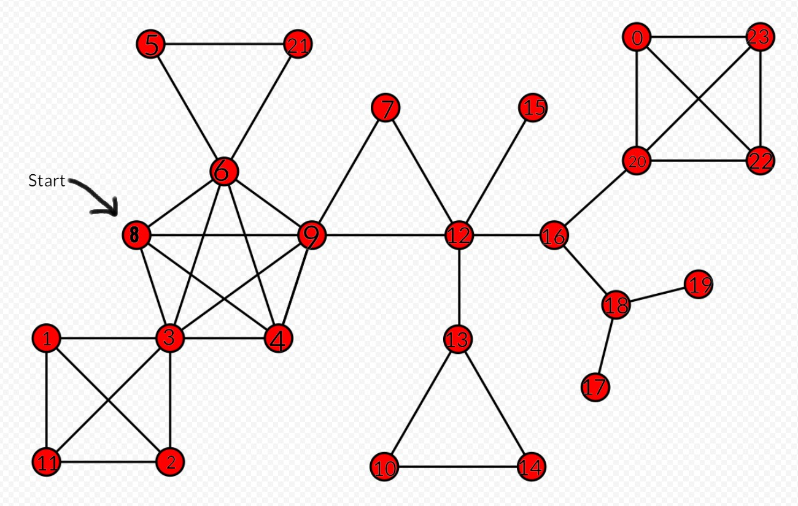

# Graph Project

## Описание

Этот проект реализует граф и предоставляет функциональность для добавления ребер, выполнения обхода в ширину (BFS). В проекте также реализованы тесты для проверки корретности работы класса `Graph` с использованием Google Test.

В качестве примера работы программы используется граф, где для вершины 8 будем искать кратчайшие пути к другим вершинам:



| Номер вершины | Кратчайший путь к вершине 8 |
|-------------|-------------|
| 0    | 5    |
| 1    | 2    |
| 2    | 2    |
| 3    | 1    |
| 4    | 1    |
| 5    | 2    |
| 6    | 1    |
| 7    | 2    |
| 8    | 0    |
| 9    | 1    |
| 10   | 4    |
| 11   | 2    |
| 12   | 2    |
| 13   | 3    |
| 14   | 4    |
| 15   | 3    |
| 16   | 3    |
| 17   | 5    |
| 18   | 4    |
| 19   | 5    |
| 20   | 4    |
| 21   | 2    |
| 22   | 5    |
| 23   | 5    |


## Зависимости

Для сборки проекта требуется:

- Компилятор C++ (например, `g++`)
- Google Test для написания и выполнения тестов

Убедитесь, что все зависимости установлены перед сборкой.

## Запуск контейнера

Для удобства разработки и запуска проекта вы можете использовать контейнер Docker. Убедитесь, что Docker установлен на вашем компьютере. 

* Чтобы построить и запустить контейнер, выполните следующую команду из корневой директории проекта:

    ```bash
    docker build -t graph_project .
    docker run --rm graph_project 

## Команды

### Сборка проекта

* Чтобы собрать проект, выполните следующую команду:

    ```bash
    make

### Запуск приложения
* Чтобы запустить проект, выполните команду:
    ```bash
    make run

### Запуск тестов 
* Чтобы запустить проект, выполните команду:
    ```bash
    make run_tests

### Очистка
* Чтобы удалить скомпилированные файлы и подготовить проект к новой сборке, выполните:
    ```bash 
    make clean